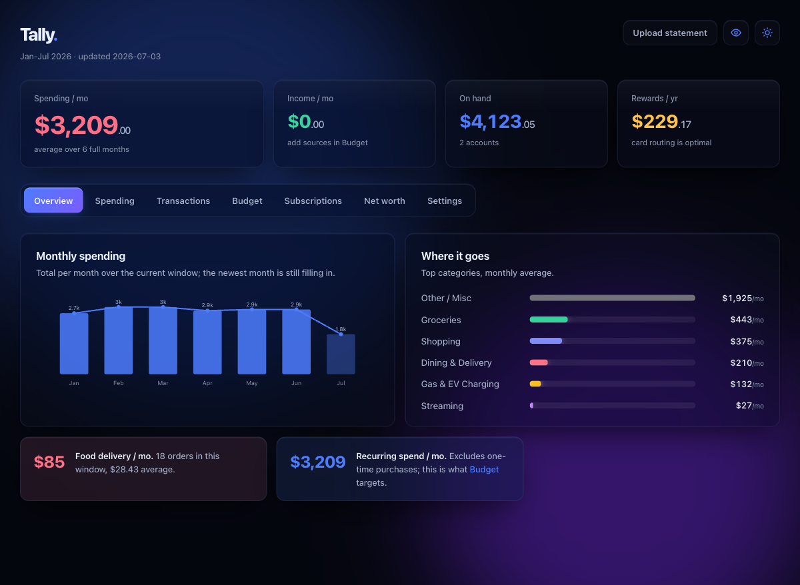
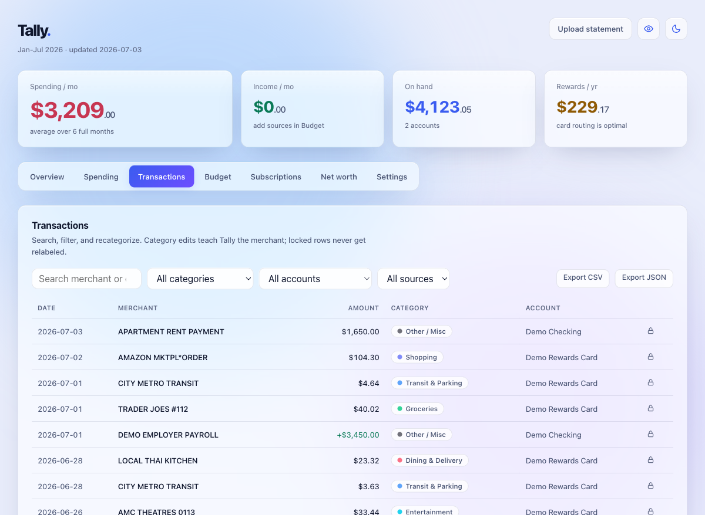
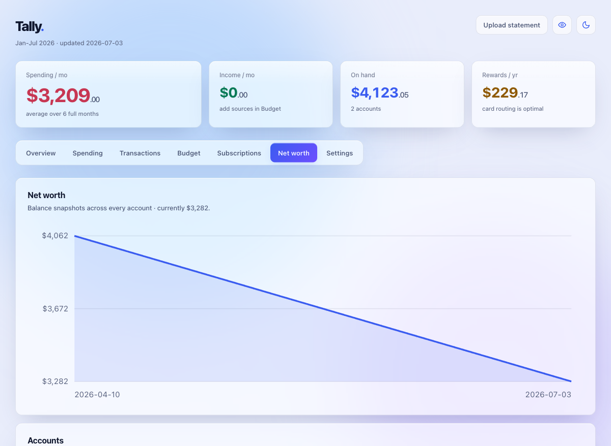

# Tally

A private, local-first personal finance app you run yourself. Tally pulls your accounts into one place, reconciles every statement to the penny, and tells you where the money goes, which subscriptions are creeping up, and which card to put each purchase on. Your data stays on your machine.

Money is signed integer cents end to end, so balances and totals are exact. No floats stored, no rounding drift.

## Why Tally

Most finance apps ask you to upload your accounts to someone else's cloud and trust that the numbers are right. Tally inverts that. It runs on localhost, keeps every byte of real data on disk, and refuses to import a statement unless the parsed transactions tie out to the totals printed on it. Formats that print no totals pass a structural gate instead, and anything that fails either gate is quarantined rather than silently stored wrong.

## Features

- **Penny-reconciled ingestion** for Apple Card CSV exports, Wells Fargo PDF statements (Autograph, Bilt, Everyday Checking), and OFX/QFX/QBO files from other banks. PDF statements must balance against their printed totals exactly. Formats without printed totals get a structural reconcile: every transaction block must parse and every FITID must be unique, so a broken block fails the whole file instead of dropping rows.
- **Apple Card screenshot OCR** with a review-before-import step. Apple Card has no aggregator, so you can snap the transaction list in the Wallet app instead. OCR runs on-device with macOS Vision; on Linux, install the `ocr` extra (`uv sync --extra ocr`) plus `apt install tesseract-ocr` for the tesseract fallback. OCR rows have no totals to reconcile, so you confirm a parsed preview before anything is written, and the rows stay flagged as OCR-sourced.
- **Plaid live sync** (sandbox or production). Statements remain ground truth: Plaid transactions land in the same canonical accounts and are matched against existing statement rows, so running both never double counts.
- **Transactions view** with search, filters, and inline recategorization. Corrections are learned and applied to future imports of the same merchant.
- **Budgets, income, accounts, and savings** stored server-side, editable from the UI.
- **Subscription detection** that infers billing cadence from recurring charges and flags price creep and likely-forgotten subscriptions.
- **Net worth over time**, built from balance snapshots across accounts.
- **Rewards routing**: which card earns the most on a given purchase, driven by a per-card rules matrix you can edit.
- **CSV and JSON export** of transactions.
- **Demo dataset**, clearly fake, so you can evaluate the app before touching real data.
- **Passkey auth** (WebAuthn) with one-time setup codes, for instances reachable beyond your own machine.
- **Daily scheduled sync** via launchd or systemd (see [`deploy/`](deploy/README.md)).

## Screenshots







## Stack

Python and FastAPI on SQLite, with SQLModel for the data layer. The frontend is a single self-contained `index.html` of vanilla JavaScript served directly by FastAPI. No build step, no framework, no node_modules.

## Quick start

You need [uv](https://docs.astral.sh/uv/) and poppler (for PDF statement parsing):

```bash
brew install poppler          # macOS
apt install poppler-utils     # Debian/Ubuntu
```

Then:

```bash
git clone https://github.com/NoahLaforet/tally.git
cd tally
./run.sh
```

Open http://localhost:8787. Use the `localhost` name rather than `127.0.0.1`: passkeys are origin-bound and cannot live on an IP origin, so `localhost` is the address that keeps auth working if you ever turn it on. The server itself binds to loopback only.

First run gives you an empty ledger and an onboarding screen: add your cards, upload a statement, connect Plaid, or load the demo dataset (there is a button for it, or `POST /api/demo/load`). Backend dependencies are pinned in `backend/pyproject.toml` and resolved by uv on first run.

To add a statement later, drop it on the upload area or POST it directly; the open dashboard refreshes itself over Server-Sent Events:

```bash
curl -F file=@statement.pdf http://localhost:8787/api/ingest
```

## Configuration

Configuration lives in a `.env` file in the repo root (`backend/.env` is also read, for older setups). Every value has a safe local default, so an empty `.env` runs fine.

```bash
cp .env.example .env
```

What is in [`.env.example`](.env.example):

- **Passkey auth.** `AUTH_ENABLED=false` by default (single local user, no login wall). When enabled, the server refuses to boot until the default `SESSION_SECRET` is replaced. The first passkey registration requires the one-time setup code printed to the server console on startup; mint more codes with `uv run python -m app.newcode`.
- **Plaid.** `PLAID_CLIENT_ID`, `PLAID_SECRET`, and `PLAID_ENV` (sandbox or production). Leave blank to stay upload-only. OAuth banks such as Chase and Wells Fargo require an https `PLAID_REDIRECT_URI` registered in the Plaid dashboard.
- **Uploads.** `MAX_UPLOAD_MB` rejects files over the limit.
- **`TALLY_ENCRYPTION_KEY`.** Written automatically the first time a Plaid token is stored; encrypts Plaid access tokens at rest in the database.
- **LLM categorizer.** Off by default. `USE_LLM_CATEGORIZER=true` with a `CLAUDE_API_KEY` categorizes unknown merchants; only the merchant string is ever sent, never amounts, dates, or accounts.

`.env` is gitignored and never committed.

## How it works

Three mechanisms keep the data trustworthy. The reconcile gate checks every statement against its printed totals (or the structural rules above) before a single row is written; a failing file is quarantined for inspection instead of imported. Every transaction gets a deterministic id hashed from its account, date, amount, and normalized merchant, so re-importing the same statement is a no-op and a per-file sequence number keeps genuine same-day duplicate charges apart. Transfers between your own accounts are detected and linked, so a card payment shows up in checking and on the card without being counted as spending twice.

## Security

- The server binds to `127.0.0.1` only. For remote access, put your own VPN or reverse proxy in front and enable passkey auth.
- When auth is on, every data route requires a session. The gate is structural (router-level, not per-route memory) and proven by a test that walks every registered route against an explicit public allowlist.
- Registration bootstrap: a fresh instance cannot be claimed by a stranger who can reach the port; the first passkey needs the setup code from the server console.
- Session cookie: HttpOnly, SameSite=lax, capped lifetime, Secure when served over HTTPS.
- Uploads: filenames reduced to a sanitized basename, size cap enforced while streaming.
- Plaid access tokens are Fernet-encrypted at rest.
- Security headers on every response.
- Privacy scan: `tools/install_hooks.sh` wires `tools/privacy_scan.py` into pre-push, so personal paths, hostnames, and secrets cannot be pushed over findings.
- The penny-reconcile gate plus quarantine means a parsing error can never quietly corrupt your books.

## Deployment and backups

[`deploy/README.md`](deploy/README.md) covers three ways to keep Tally running: launchd on macOS (always-on server plus a daily sync job), systemd units for Linux and ARM boards, and Docker.

For backups, `tools/backup.sh` writes a consistent snapshot using `VACUUM INTO`, which is safe while the server is running under WAL. To restore: stop the server, replace `backend/data/tally.db` with the backup, delete any `tally.db-wal` and `tally.db-shm` files next to it, and start again.

## Testing

```bash
cd backend && uv run pytest
```

GitHub Actions runs the test suite, the privacy scan, and a fresh-clone smoke boot (no `.env`, no secrets, just `run.sh`) on every push.

## License

MIT. See [LICENSE](LICENSE).
